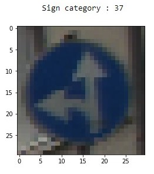
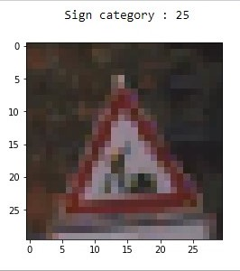
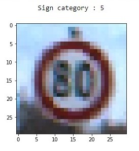

# Traffic Sign Recognition
> Recognizing Traffic signs using a Convolutional Neural Network.

Self driving cars are becoming very popular due to efforts of companies like Tesla in automating their electric vehicles.
To become level 5 autonomous it is important that these cars would have to correctly identify traffic signs and follow traffic rules.
After identifying these traffic signs it should also be able to take correct decisions suitably.

> Read more about it in my [Blogpost]

> Download the Dataset here : [Dataset url](https://www.kaggle.com/meowmeowmeowmeowmeow/gtsrb-german-traffic-sign)

## About the Dataset :

The German Traffic Sign Benchmark is a multi-class, single-image classification challenge held at the International Joint Conference on Neural Networks (IJCNN) 2011. The dataset has the following properties:

- Single-image, multi-class classification problem
- More than 40 classes
- More than 50,000 images in total
- Large, lifelike database

  

## Motivation :
Self-driving cars are becoming very popular due to the efforts of companies like Tesla in automating their electric vehicles. To become level 5 autonomous these cars would have to correctly identify traffic signs and follow traffic rules. After identifying these traffic signs it should also be able to take correct decisions suitably.
